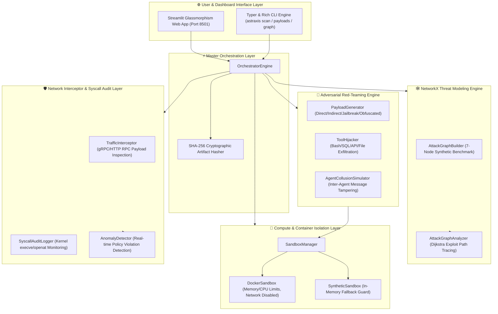

# 🛡️ ASTRAXIS-AI Architecture & System Security Guide

> **Autonomous Multi-Agent AI Red-Teaming, Exploit Simulation & Defense Sandbox Infrastructure**

---

## 🏛️ System Architecture Overview

ASTRAXIS-AI is engineered as a modular, 6-tier security sandbox infrastructure designed to red-team multi-agent AI applications, trace multi-hop exploit vectors, intercept unauthorized syscalls, and generate tamper-proof SHA-256 audit reports.



---

## 🔑 Core Engine Components

### 1. ⚙️ Core Package (`astraxis.core`)
- **`config.py`**: Typed parameters managed by Pydantic `BaseSettings`.
- **`hasher.py`**: Produces deterministic SHA-256 fingerprints for JSON reports.
- **`logger.py`**: Color-coded Rich console logger with timestamps and log levels.

### 2. 🔴 Red-Teaming Package (`astraxis.redteam`)
- **`payloads.py`**: Generates multi-category adversarial payloads (Direct Injection, Indirect Document Injection, DAN Jailbreaks, Base64 Obfuscation, System Override).
- **`hijack.py`**: Simulates tool hijacking attempts against `bash_exec`, `sql_query`, `api_call`, and `file_read`.
- **`collusion.py`**: Evaluates inter-agent trust escalation and secret message passing.

### 3. 🕸️ Threat Modeling Package (`astraxis.graph`)
- **`nodes.py` & `edges.py`**: Graph entities (Agents, Tools, Databases, Credentials) and directed relationship edges.
- **`builder.py`**: NetworkX `DiGraph` construction for multi-agent architectures.
- **`analyzer.py`**: Dijkstra and simple-path traversal to trace multi-hop exploit paths from untrusted entries to high-value targets.

### 4. 🐳 Sandbox Package (`astraxis.sandbox`)
- **`docker_sandbox.py`**: Isolated container execution using Docker Engine SDK (`512MB` RAM limit, `network_mode="none"`).
- **`synthetic_sandbox.py`**: Lightweight, in-memory zero-dependency fallback guard.
- **`manager.py`**: Automatic fallback manager detecting Docker availability seamlessly.

### 5. 🛡️ Interceptor Package (`astraxis.interceptor`)
- **`traffic.py`**: Real-time gRPC/HTTP payload inspection.
- **`syscall.py`**: Kernel-level syscall tracking (`execve`, `openat`, `connect`).
- **`detector.py`**: Anomaly detection engine producing `AnomalyViolation` objects.

---

## 🚀 Quickstart Command Guide

### Run CLI Audit Scan
```bash
# Run scan using synthetic sandbox fallback
astraxis scan --backend synthetic

# View adversarial payload library
astraxis payloads

# Trace attack graph exploit paths
astraxis graph
```

### Launch Web Dashboard
```bash
python -m streamlit run src/astraxis/ui/app.py --server.port 8501
```

### Run Full Pytest Suite
```bash
pytest tests/
```
